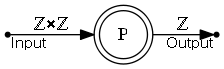
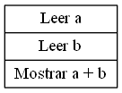

# TP #1 - Adición

## Autores
Usuario | Legajo | Apellido | Nombre
------- | ------ | -------- | ------
[ariel-](https://github.com/ariel-) | 166216-8 | Silva | Ariel

## Enunciado
### Objetivos
* Completar todas las etapas de la resolución de problemas para un problema simple: la adición de dos números.

### Temas
* Resolución de problemas.
* Entrada de datos.
* Enteros.
* Adición.
* Léxico.
* Representación de algoritmos.

### Problema
Obtener del usuario dos número y mostrarle la suma.

### Tareas
1. Escribir el archivo `readme.md` que actúa como _front page_ de la resolución que contenga lo solicitado en la sección “Carpetas para cada Resolución”, y en particular, el _Análisis del Problema_ y el _Diseño de la Solución_:
* Etapa #1: Análisis del problema:
    * Transcripción del problema.
    * Refinamiento del problema e Hipótesis de trabajo.
    * Modelo IPO.
* Etapa #2 Diseño de la Solución:
    * Léxico del Algoritmo.
    * Representación del Algoritmo:
        * Representación visual.
        * Representación textual.
2. Escribir, compilar, ejecutar, y probar Adición.cpp.

### Restricciones
* Ninguna.

### Productos
* readme.md
* Adición.cpp

## Resolución
### Análisis
#### Transcripción del problema
* Obtener del usuario dos número y mostrarle la suma.

#### Refinamiento del problema e Hipótesis de trabajo
* Obtener del usuario dos números y mostrarle la suma.
* Se asumen números enteros

#### Modelo IPO

### Diseño de la Solución
#### Léxico
* a, b ∈ ℤ

#### Representación
##### Visual
* Diagrama Nassi-Shneiderman

##### Textual
1. Leer a
2. Leer b
3. Mostrar a + b
